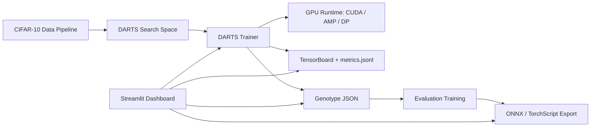
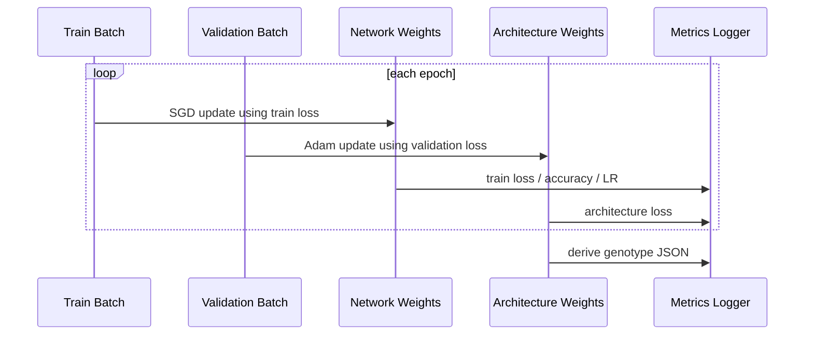
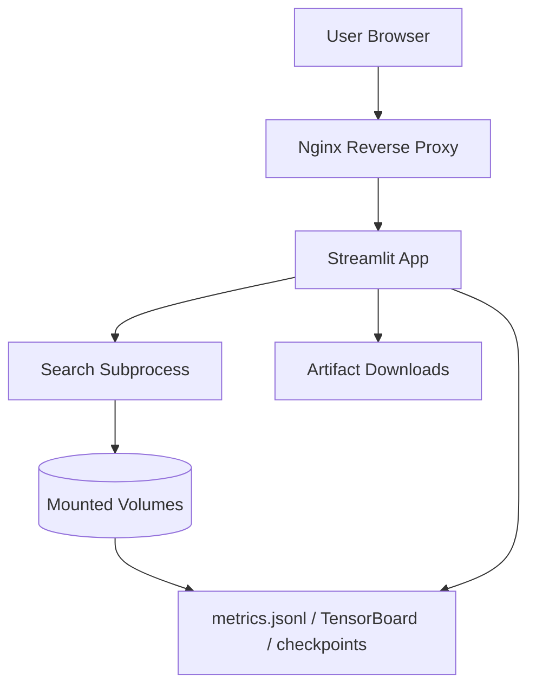
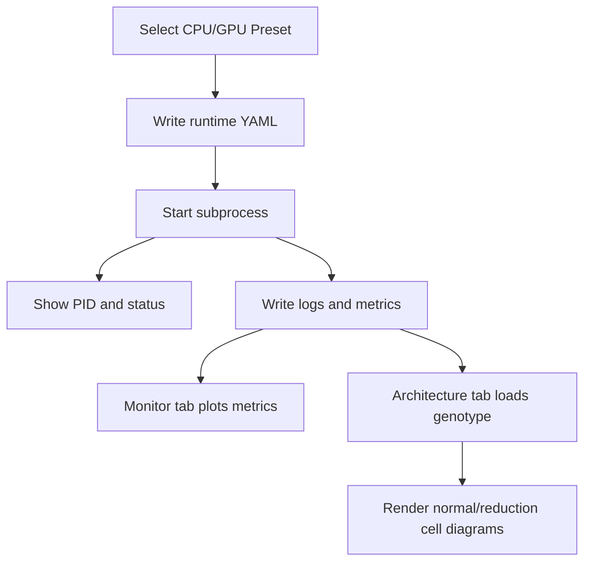

# Architecture

## High-Level System Architecture

```mermaid
flowchart LR
    A[CIFAR-10 Data Pipeline] --> B[DARTS Search Space]
    B --> C[DARTS Trainer]
    C --> D[GPU Runtime: CUDA / AMP / DP]
    C --> E[TensorBoard + metrics.jsonl]
    C --> F[Genotype JSON]
    F --> G[Evaluation Training]
    G --> H[ONNX / TorchScript Export]
    I[Streamlit Dashboard] --> C
    I --> E
    I --> F
    I --> H
```

## DARTS Search Loop

```mermaid
sequenceDiagram
    participant Train as Train Batch
    participant Val as Validation Batch
    participant Net as Network Weights
    participant Alpha as Architecture Weights
    participant Log as Metrics Logger

    loop each epoch
        Train->>Net: SGD update using train loss
        Val->>Alpha: Adam update using validation loss
        Net->>Log: train loss / accuracy / LR
        Alpha->>Log: architecture loss
    end
    Alpha->>Log: derive genotype JSON
```

## Deployment Architecture

```mermaid
flowchart TB
    U[User Browser] --> N[Nginx Reverse Proxy]
    N --> S[Streamlit App]
    S --> P[Search Subprocess]
    P --> V[(Mounted Volumes)]
    V --> M[metrics.jsonl / TensorBoard / checkpoints]
    S --> M
    S --> D[Artifact Downloads]
```

## Streamlit Control Flow

```mermaid
flowchart TD
    A[Select CPU/GPU Preset] --> B[Write runtime YAML]
    B --> C[Start subprocess]
    C --> D[Show PID and status]
    C --> E[Write logs and metrics]
    E --> F[Monitor tab plots metrics]
    E --> G[Architecture tab loads genotype]
    G --> H[Render normal/reduction cell diagrams]
```
